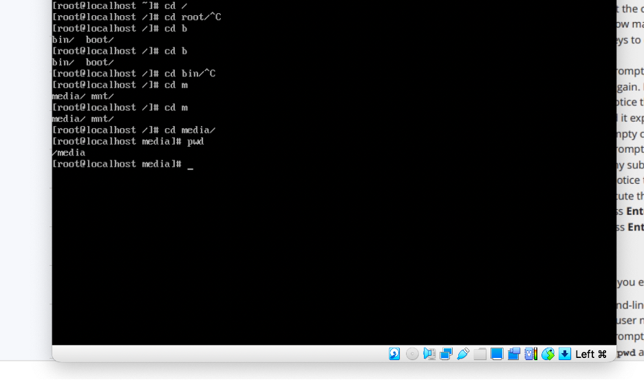
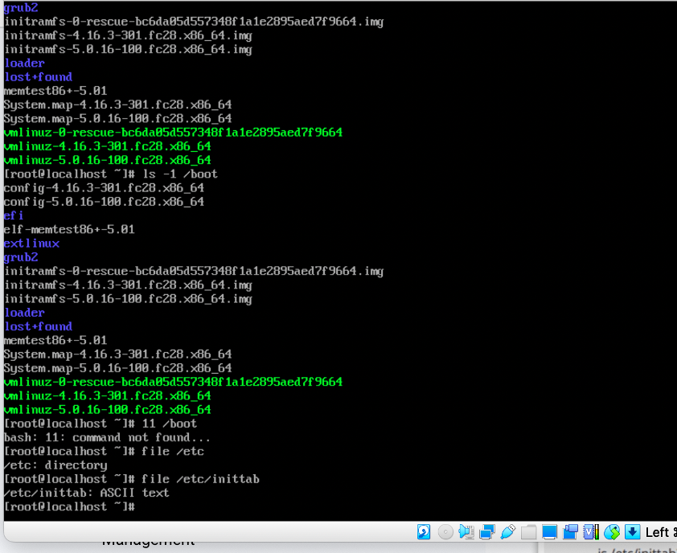

# CIT 352: Chapter 3

<!-- TODO -->
```
samuel joshua
```

## Project 3-1

### Step 14 

What would have been the absolute pathname you could have used?

<!-- TODO -->
```
cd/home/user1/Desktop.
```

## Project 3-2

### Step 10

Insert the screen capture

<!-- TODO -->


## Project 3-3

### Step 16

Insert the screen capture

<!-- TODO -->


## Project 3-4

### Step 10

Insert the screen capture

<!-- TODO -->
.png)

## Project 3-5

### Step 34

Insert the screen capture

<!-- TODO -->
.png)

## Project 3-6

### Step 8

Insert the screen capture

<!-- TODO -->
.png)

## Project 3-7

### Step 15

Insert the screen capture

<!-- TODO -->
.png)

## Command Reference

List all new commands you learned in this chapter.

<!-- TODO -->
```

grep -v “Inn” sample1

grep “inn” sample1

grep “I” sample1

grep “t.e” sample1

grep “w…e” sample1

grep “^I” sample1

grep “(we|next)” sample1

egrep “(we|next)” sample1

grep “Inn$” sample 1
```

## Discovery Exercises

Solve the following problems from the textbook under Discovery Exercises.
Search the internet for answers if you don't know.

### Exercise 2 

<!-- TODO -->
```
a. cd /usr

b. cd../../usr    

c. cd /usr/local/share/info            

d. cd share/info          

e. cd /etc         

f. cd ../../etc    
```

### Exercise 3

<!-- TODO -->
```
a. ls /etc/*.cfg

b. ls -a /home/user1   

c. ls -d lvar       

d. ls -a /bin/[a]            

e. ls -a /bin/???

f. ls -a /bin/???[ht]
```

