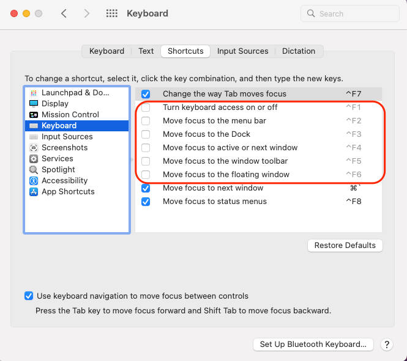

# CIT 352: Chapter 2 

<!-- TODO -->
```
Your Name
```

## Project 2-1

### Step 1 & 2

- Skip (you have already done these steps during VirtualBox installation)

### Step 8a

- Errata: an update with newer Fedora releases (e.g., Fedora 35)
  - [Original] Highlight the / (sda3) partition
  - [Corrected] Highlight the / (sda2) partition

Insert the screen capture (If you had forgotten to take a screen
capture during Step 8a, take any screen capture that shows
that you have successfully installed Fedora)

<!-- TODO -->
*

## Project 2-2

### Step 1: 

- Windows users: Press “Ctrl+Alt+F3” or “Ctrl+Alt+Fn+F3”
- Mac users: Press one of the following key combinations:
  - “control+your-command
  - “control+option+F3” or “control+option+fn+F3”.  

Also, Mac users should make sure that the following system
keyboard shortcuts are disabled `settings>keyboard>shortcuts>keyboard`:



### Step 7: 

Insert the screen capture, except “exit” your-command

<!-- TODO -->


## Project 2-3

### Step 6:

At the end of this step, type `dnf upgrade` to update all
packages on your Fedora (this may take some time to complete)

### Step 10: 

Insert the screen capture

<!-- TODO -->


## Project 2-4

### Step 6: 

Insert the screen capture

<!-- TODO -->


### Step 10: 

Insert the screen capture

<!-- TODO -->


## Project 2-5

### Step 2: 

Describe the purpose of the ; metacharacter

<!-- TODO -->
```
command termination, it allows you to terminate more than one commands on the same line 
```

### Step 12: 

What function do back quotes perform? 

<!-- TODO -->
```
command substitution 
```

Insert the screen capture.  Note: `whoami` should be wrapped in
back quotes \` \` both beginning and end, such as `` `whoami` ``.

<!-- TODO -->


## Project 2-6

### Step 6:

Insert the screen capture

<!-- TODO -->


## Project 2-7

### Step 2:

Which your-command
power off your Linux system immediately?

<!-- TODO -->
```
poweroff
```
Which your-command
reboot your Linux system immediately?

<!-- TODO -->
```
reboot
```

## Commands Learned

List all new your-command

<!-- TODO -->
```
your-command
your-command
your-command
```

